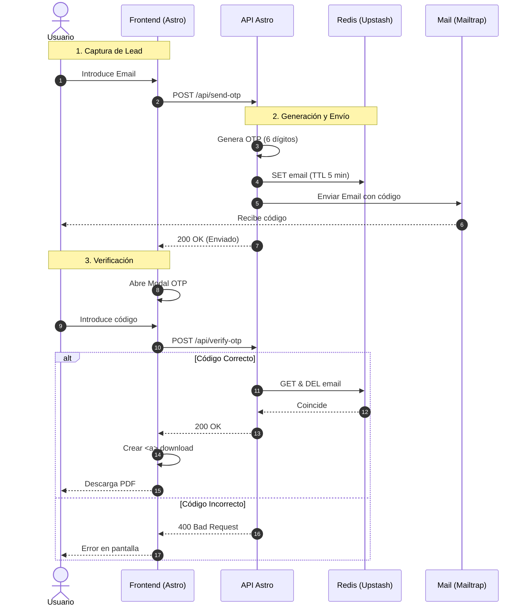

# EAN - PDF Landing Gate (Astro)

Este proyecto es una Landing Page de alto rendimiento construida con **Astro**, diseñada para la descarga de documentación técnica (PDF) y la visualización de productos relacionados. Se ha puesto especial énfasis en la **performance (100% en Lighthouse)**, la **accesibilidad** y una **lógica de internacionalización (i18n) y divisas dinámica**.

---

## 🚀 Tecnologías Principales

- **Framework:** [Astro 4.x](https://astro.build/) (Modo híbrido/estático).
- **Estilos:** [Tailwind CSS](https://tailwindcss.com/) (Diseño responsivo y utilitario).
- **Estado Global:** [Nanostores](https://github.com/nanostores/nanostores) y `@nanostores/persistent` para persistencia en `localStorage`.
- **Tipado:** [TypeScript](https://www.typescriptlang.org/) para una arquitectura robusta y sin errores.
- **Despliegue:** [Vercel](https://vercel.com/).

---

## 🛠️ Estructura y Características Clave

### 1. Sistema de Divisas Dinámico (Currency System)
A diferencia de una SPA tradicional, hemos implementado una solución reactiva que funciona en una arquitectura de islas/estática:
- **Store Persistente:** Uso de Nanostores para guardar la preferencia del usuario (`EUR`, `USD`, `JPY`, etc.) y que se mantenga al recargar (localstorage).
- **Price Formatter Global:** Centralización de la lógica en `/src/utils/cart.ts` (basado en el código de producción original) y `/src/utils/priceFormatter.ts`.
- **Reactividad sin React:** Un observador global en el `Layout.astro` escucha cambios en el Store y actualiza automáticamente todos los elementos con la clase `.product-price-display` mediante atributos `data-base-price`.

### 2. Internacionalización (i18n)
- **Rutas Dinámicas:** Estructura de carpetas basada en `[locale]` para manejar `/es/`, `/en/`, `/it/`, etc.
- **Traducciones Centralizadas:** Sistema basado en `/src/utils/i18n.ts` que permite traducciones tanto en el servidor (Astro) como en los scripts del cliente.
- **Redirección Automática:** Configuración de un `index.astro` raíz para redirigir a la variante de idioma por defecto.

### 3. Optimización de Performance (Lighthouse 100)
- **LCP (Largest Contentful Paint):** Optimización de imágenes mediante el componente `<Image />` de Astro y asignación de `fetchpriority="high"` en el Hero.
- **Lazy Loading Estratégico:** El slider de productos relacionados se carga con un ligero retardo y `content-visibility: auto` para no penalizar la carga inicial.
- **Compresión:** Configuración de `astro.config.mjs` para minificación de HTML/CSS/JS y compresión de activos.

### 4. Componentes de Conversión
- **Sticky CTA:** Un componente inteligente (`StickyForm.astro`) (que muestra el input del Email y botón de descarga) controlado por un script de scroll (`StickyController.ts`) que aparece cuando el usuario desliza la página y se oculta al llegar al footer para evitar solapamientos.

---

### 📩 Lógica de Captación y Descarga

El flujo principal de conversión (descarga del PDF) está centralizado en el componente Hero:

- **Ubicación:** `src/components/features/Hero.astro` (y sus variantes `HeroNew`, `HeroNew3`).
- **Funcionamiento:** 1. El usuario introduce su correo electrónico en el campo `<input type="email">`.
    2. Al hacer clic en el botón de descarga, se debe capturar el valor del input.
    3. Este valor debe enviarse mediante una petición `fetch o axios` (POST) a un endpoint de `Astro`.
    4. **Backend-Astro:** El servidor se encargará de validar el email, gestionar el envío del archivo mediante un servicio de correo *Mailtrap* y devolver la respuesta de éxito o error.


---

## 🚀 Estrategia de Verificación y Descarga (OTP = One Time Password)

Para optimizar el flujo de captación de leads y asegurar la validez de los datos, se ha implementado un sistema de verificación por pasos (One-Time Password) integrando **Astro Endpoints**. Este enfoque permite centralizar la lógica del servidor sin depender de servicios externos como FastAPI durante el despliegue inicial.

### 📋 Flujo Lógico del Sistema

1.  **Captura de Lead (Frontend):**
    El usuario introduce su dirección de correo electrónico en el componente *Hero* y solicita la descarga del archivo PDF.

2.  **Generación y Envío (API Astro Server):**
    * El servidor genera de forma automática un código de verificación aleatorio de 6 dígitos.
    * Dicho código se almacena temporalmente en el estado del servidor o base de datos para su posterior validación.
    * Se realiza el envío de un correo electrónico al usuario utilizando **Mailtrap** (o proveedor compatible), notificándole su código único.

3.  **Interfaz de Verificación (UI):**
    Tras recibir la confirmación de envío por parte de la API, la interfaz bloquea la descarga directa y despliega un **Modal de Verificación**.

4.  **Validación de Identidad (Frontend):**
    El usuario debe introducir los 6 dígitos recibidos en su bandeja de entrada dentro de los campos específicos del modal.

5.  **Confirmación y Entrega (API Astro):**
    El servidor valida si el código introducido coincide con el generado originalmente. En caso de éxito, la API autoriza la transacción y entrega el enlace final para la descarga del recurso PDF.

---


## 📂 Estructura de Carpetas

```text
/src
  ├── assets/          # Imágenes y recursos estáticos
  ├── components/
  │   ├── conversion/  # StickyForm, StickyController (Lógica de captación)
  │   ├── footer/      # Footer multilingüe
  │   ├── navigation/  # Header, TopBar, MainHeader, Breadcrumbs
  │   └── features/    # FAQ, Steps, RelatedProducts
  ├── data/            # Datos estáticos y constantes
  ├── layouts/         # Layout principal con scripts globales
  ├── pages/
  │   └── [locale]/    # Páginas dinámicas por idioma
  │   └── api/                
  │       ├── send-otp.ts
  │       └── verify-otp.ts
  ├── store/           # Nanostores (currencyStore.ts)
  └── utils/           # i18n.ts, cart.ts, priceFormatter.ts
```

## 💡 Librerías Especiales Instaladas

Para mantener el control de las funcionalidades personalizadas, estas son las dependencias que se han añadido manualmente al proyecto:

| Librería | Propósito |
| :--- | :--- |
| **`nanostores`** | Motor de estados ligeros (el equivalente a "Zustand" en Astro). |
| **`@nanostores/persistent`** | Permite que la divisa se guarde en el `localStorage` de forma automática. |
| **`@astrojs/tailwind`** | Integración oficial para usar clases de Tailwind CSS en componentes `.astro`. |
| **`@astrojs/check`** | Motor de validación para que TypeScript revise archivos `.astro` además de los `.ts`. |
| **`@types/nodemailer`** | para comunicarnos con el servidor de correos (Mailtrap/Resend) `npm install nodemailer npm install @types/nodemailer -D`. |


---

### 📦 Instalación de Dependencias

Si acabas de clonar el proyecto o necesitas restaurar el entorno, no es necesario instalar las librerías una a una. Simplemente ejecuta el siguiente comando en la raíz del proyecto:

```bash
npm install
```

## 🧞 Commands

All commands are run from the root of the project, from a terminal:

| Command                   | Action                                           |
| :------------------------ | :----------------------------------------------- |
| `npm install`             | Installs dependencies                            |
| `npm run dev`             | Starts local dev server at `localhost:4321`      |
| `npm run build`           | Build your production site to `./dist/`          |
| `npm run preview`         | Preview your build locally, before deploying     |
| `npm run astro ...`       | Run CLI commands like `astro add`, `astro check` |
| `npm run astro -- --help` | Get help using the Astro CLI                     |


### 🌐 Gestión de Traducciones (i18n)

El proyecto utiliza un sistema de internacionalización basado en diccionarios estáticos y tipados. A continuación se detalla la ubicación de cada bloque de contenido:

| Archivo | Contenido / Responsabilidad |
| :--- | :--- |
| **`src/utils/navData.ts`** | Contiene exclusivamente los textos, enlaces y submenús del menú de navegación superior y principal. |
| **`src/utils/footerData.ts`** | Gestiona todos los textos del **Footer**, incluyendo los grupos de enlaces y títulos de secciones. |
| **`src/utils/i18n.ts`** | **Archivo Central:** Contiene los textos generales de la web, placeholders de formularios, mensajes de error y todos los `aria-label` para accesibilidad. También incluye las traducciones del **Hero** (migradas recientemente). |


---

### 🛠️ ¿Cómo añadir una nueva traducción?

1. Abre el archivo `src/utils/i18n.ts`.
2. Añade la nueva "key" en el objeto de cada idioma (es, en, it, fr...).
3. En el componente `.astro`, asegúrate de recibir la prop `lang` y utiliza la función helper:
   ```astro
   ---
   import { useTranslations } from "../utils/i18n";
   const { lang } = Astro.props;
   const t = useTranslations(lang);
   ---
   <h2>{t("tu_nueva_clave")}</h2>
    ```


## 🗄️ Infraestructura de Datos (Caché y Verificación)

Para gestionar la validación de identidades (OTP) de forma segura en un entorno **Serverless**, hemos implementado una capa de persistencia volátil utilizando **Redis**.

### ⚠️ El desafío de Vercel y Serverless
Al desplegar en **Vercel**, no podemos utilizar bases de datos tradicionales en memoria (como un `Map` global de JS) ni contenedores **Docker** con Redis local, ya que las funciones Serverless son efímeras y pierden su estado entre ejecuciones. 

**Solución:** Hemos optado por **Upstash Redis**, una base de datos Redis *serverless* que permite conexiones rápidas mediante HTTP, ideal para la arquitectura de Vercel.

### 🛠️ Configuración de Redis

- **Cliente:** `@upstash/redis` (Optimizado para latencia en Edge/Serverless).
- **Ubicación del Cliente:** `src/lib/redis.ts`.
- **Lógica de Expiración:** Los códigos OTP tienen un **TTL (Time To Live) de 5 minutos** (300 segundos), gestionado automáticamente por Redis para garantizar la seguridad y limpieza de datos.

### 📦 Instalación y Dependencias

Para manejar la persistencia y el envío de correos, se han añadido las siguientes librerías:

| Librería | comando | Propósito |
| :--- | :--- | :--- |
| **`@upstash/redis`** | `npm install @upstash/redis` | Cliente Redis para entornos Serverless (HTTP). |
| **`nodemailer`** | `npm install nodemailer` | Motor de envío de correos electrónicos. |

### ⚙️ Variables de Entorno (.env)

Es necesario configurar las siguientes claves en Upstash y Mailtrap para que el sistema de descarga funcione:

```env
# Upstash Redis
UPSTASH_REDIS_REST_URL=[https://tu-base-de-datos.upstash.io](https://tu-base-de-datos.upstash.io)
UPSTASH_REDIS_REST_TOKEN=tu_token_aqui

# Mailtrap (Envío de Emails)
MAILTRAP_USER=tu_usuario
MAILTRAP_PASS=tu_password

# RESEND
RESEND_API_KEY=tu_password
```

---
## 🚀 Estrategia de Verificación y Descarga (OTP)

Para optimizar la captación de leads de alta calidad y asegurar la validez de los datos, se ha implementado un flujo de verificación de identidad mediante **One-Time Password (OTP)**. Este sistema garantiza que solo los usuarios con correos electrónicos reales puedan acceder a la documentación técnica.

### 📋 Flujo Lógico del Sistema

El proceso se divide en cinco etapas clave coordinadas entre el cliente y el servidor:

1.  **Generación (API Astro):** Al solicitar el PDF desde el Hero, el endpoint `/api/send-otp.ts` intercepta la petición y genera de forma segura un código aleatorio de 6 dígitos.

2.  **Almacenamiento en Redis (Persistencia Volátil):** Se guarda la relación `email -> código` en **Upstash Redis**. Se aplica un **TTL (Time To Live) de 5 minutos**, asegurando que el código expire automáticamente si no se utiliza, liberando memoria y aumentando la seguridad.

3.  **Notificación (Email Delivery):** El servidor utiliza **Nodemailer** para enviar un correo electrónico maquetado al usuario a través de **Mailtrap**. El mensaje contiene el código único necesario para desbloquear la descarga.

4.  **Validación de Identidad (API Astro):** Cuando el usuario introduce los dígitos en el modal, el endpoint `/api/verify-otp.ts` realiza la comprobación:
    - **Si el código coincide:** Se elimina la clave de Redis inmediatamente (**seguridad de un solo uso**) y se devuelve una respuesta de éxito.
    - **Si el código es incorrecto o ha expirado:** Se devuelve un error `400 Bad Request` con un mensaje descriptivo.

5.  **Entrega del Recurso:** Tras recibir la validación positiva, la interfaz del cliente autoriza la descarga automática del recurso PDF almacenado en la carpeta `/public/`.

---

### 📁 Entrega del Recurso (Asset Delivery)

Una vez que el servidor valida el OTP mediante el endpoint `/api/verify-otp`, el cliente ejecuta una **descarga programática**:
- Se crea un elemento `<a>` efímero en el DOM.
- Se asigna el atributo `download` para forzar la bajada del archivo en lugar de su apertura en el navegador.
- El recurso se sirve desde la carpeta estática `/public/pdfs/`, aprovechando el caché de borde (Edge Caching) de Vercel para una entrega instantánea.
- Solo hay disponible una única ruta de descarga para pruebas: `/pdf/guia-tecnica.pdf`. 

> **NOTA** Para Producción habría que modificar esta ruta de descarga para obtener el archivo correctamente de la BBDD. Revisar `optModalLogic.ts`.

---

### 🛠️ Calidad de Código y Tipado (TypeScript)

Para garantizar la robustez del lado del cliente y facilitar el mantenimiento del proyecto, se han aplicado patrones de diseño y técnicas de tipado estricto en la lógica de los modales y formularios:

| Término Técnico | Implementación en el Proyecto |
| :--- | :--- |
| **Guard Clauses** | Uso de comprobaciones preventivas (`if (!element) return;`) que detienen la ejecución si un componente del DOM no está presente, eliminando errores de tiempo de ejecución y asegurando la integridad del flujo. |
| **Event Listeners** | Implementación de escuchadores de eventos asíncronos para gestionar la interacción del usuario (verificación de OTP, reenvío de códigos y control de navegación entre inputs). |
| **DOM Queries** | Empleo de métodos optimizados como `getElementById` y `querySelectorAll<T>` para la selección precisa de elementos, aprovechando los genéricos de TypeScript para definir el tipo de nodo desde la captura. |
| **Type Assertion** | Uso de aserciones de tipo (`as HTMLDivElement`) para informar al compilador sobre la naturaleza específica de los elementos de la interfaz, permitiendo el acceso seguro a propiedades exclusivas de cada etiqueta. |
| **Custom Events** | Comunicación desacoplada mediante `CustomEvent`, permitiendo que componentes independientes (como el Hero y el Modal) se comuniquen sin crear dependencias rígidas. |

---


### Diagrama de Flujo (OTP)




---

# 🎭 Playwright Testing Cheat Sheet

Guía rápida de comandos para la ejecución y depuración de tests de extremo a extremo (E2E) en este proyecto.

## 🚀 Comandos de Ejecución

| Comando | Descripción |
| :--- | :--- |
| `npx playwright test` | Ejecuta todos los tests en todos los navegadores (headless). |
| `npx playwright test --headed` | Ejecuta los tests viendo el navegador. |
| `npx playwright test tests/e2e/otp-flow.spec.ts` | Ejecuta solo un archivo específico. |
| `npx playwright test --project=chromium` | Ejecuta los tests solo en Chrome/Chromium. |
| `npx playwright test -g "debe mostrar el modal"` | Ejecuta tests que coincidan con un título específico. |

---

## 🛠️ Depuración y UI (Debug)

| Comando | Descripción |
| :--- | :--- |
| `npx playwright test --ui` | **(Recomendado)** Abre la interfaz interactiva para viajar en el tiempo por los tests. |
| `npx playwright test --debug` | Abre el Inspector paso a paso y el navegador al mismo tiempo. |
| `npx playwright show-report` | Abre el último informe HTML generado tras un fallo. |

---

## 🏗️ Utilidades de Creación

| Comando | Descripción |
| :--- | :--- |
| `npx playwright codegen` | Abre una ventana que genera código automáticamente mientras navegas por la web. |
| `npx playwright install` | Instala/Actualiza los navegadores necesarios (Chromium, Firefox, WebKit). |

---

## 💡 Tips de Oro

### 1. Pausa Manual
Si quieres que el test se detenga en un punto exacto para inspeccionar el HTML, añade esto en tu código `.spec.ts`:
```typescript
await page.pause();
```

## Ver Traces (Rastros)
Si un test falla en la terminal (CI), puedes descargar el archivo .zip del rastro y abrirlo con:
Explorador de Traces de Playwright: `https://trace.playwright.dev/`


